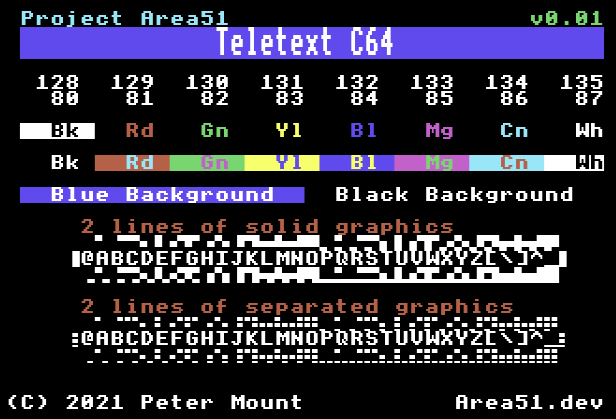

# Teletext Emulator for the C64
This directory contains an emulator of the BBC Micro's Mode 7 teletext display mode for the Commodore C64.

The emulator consists of a small <3K driver file loaded at &C000 in the C64 address map.
It exposes a set of routines at that address from which a user program can then use to
interact with the teletext screen.

The driver is not compatible with Commodore Basic due to Zero page requirements.

To use the driver you need to first call teletextInit (&C000) then one of the provided
routines, usually oswrch & writeString.

## API
The following are the public entry points into the driver

### C000 Initialisation

To initialise the screen you need to call the routine at &C000.
This will configure the C64's screen to show a blank black screen ready for use.

### C003 osascii
Named after the BBC MOS equivalent routine, this will pass the character in A to oswrch
unless it's a CR (&0D/13) in which case it calls osnewl to move the cursor to the start
of the next line.
### C007 osnewl
Named after the BBC MOS equivalent routine, this moves the cursor to the start of the next
line. This routine actually just sends the 2 byte LF,CR sequence (&0A,&0D) to oswrch.

### C00E oswrch

Named after the BBC MOS equivalent routine, this takes a character in the Accumulator
and displays it on the screen.

This routine accepts the same VDU control characters that the BBC does, although only a few
of them are actually implemented, all of the multiple character sequence codes require the
same number so remain compatible with the BBC Micro.

The ones implemented are:

| Char  | Name | Action |
| ----- | ---- | ------ |
| 00  0 | NOP | Does nothing |
| 08  8 | BS | Backspace cursor one character |
| 09  9 | HT | Advance cursor one character |
| 0A 10 | LF | Move cursor down one line |
| 0B 11 | VT | Move cursor up one line |
| 0C 12 | FF | Clear screen |
| 0D 13 | CR | Move cursot to start of current line |
| 1E 30 | RS | Move cursor to home at top left of the screen |
| 1F 31 | US | Move text cursor to X, Y where coordinates are provided by the next 2 bytes submitted to oswrch |
All other codes that require multiple bytes are only supported to the point that oswrch will
consume those extra bytes. This has been done to allow code to be ported from the BBC to the C64 with minimal changes.

### C011 writeString

This routine will write a null (&00) terminated string to oswrch. Unlike most implementations this routine knows
the internal state of oswrch so that it only terminates on a null if there are no more pending bytes required by oswrch.

For example: the sequence 31,0,10 will position the cursor at column 0 of row 10 but will not terminate the string.

### C014 refreshScreen

This routine will refresh the screen with the contents of the framebuffer. It's useful if the framebuffer was updated
outside of the driver - for example by loading a screen directly from disk. In that instance refreshScreen needs to be
called, so the actual screen is displayed.

## Memory Map
The driver requires a total of 13K of memory + 16 bytes of zero page:

| Address range | Contents |
| ------------- | -------- | 
| 0080 - 008F | Zero page workspace |
| 0400 - 07E7 | Teletext screen buffer |
| 07E8 - 07FF | Workspace |
| C000 - CBFF | Teletext driver code |
| CC00 - CFFF | VIC-II Colour ram |
| E000 - FFFF | VIC-II Bitmap |

Due to requiring zero page, the driver is incompatible with Basic.

## Implementation

The following features are implemented:

### Text colour controls
Writing characters 129 to 135 will cause subsequent characters to change to the defined
colour - up to the next colour control character.

| Char   | Action |
| ------ | ------ |
| 80 128 | Alphanumeric black* |
| 81 129 | Alphanumeric red |
| 82 130 | Alphanumeric green |
| 83 131 | Alphanumeric yellow |
| 84 132 | Alphanumeric blue |
| 85 133 | Alphanumeric magenta |
| 86 134 | Alphanumeric cyan |
| 87 135 | Alphanumeric white |
| 9C 156 | Black background |
| 9D 157 | New background |

Note: &80 (128) is not supported on the BBC Micro but is defined in latter Teletext standards.
It's implemented here as it required no coding to implement.
Not implementing it would have increased the size of the driver.

### Background colour

| Char   | Action |
| ------ | ------ |
| 9C 156 | Black background |
| 9D 157 | New background |

Character 157 will make the background colour that of the current text colour.
e.g. the sequence 132, 157, 135 will set the following text to White with a Blue background.

Note: One of the unusual ways Teletext works is that if you change the character before the 157 to another
value then the background changes automatically to the new colour without needing to send the 157 again.
If the new character is not a colour one, then the colour will be that of the preceding character.
This will flow back to the beginning of that line.

All lines begin with White text & a Black background.

Character 156 turns the background off - so to black.

### Graphics controls

Writing characters 145 to 151 will cause subsequent characters to change to the defined
colour - up to the next colour control character. The characters would also be shown as
sixel (6 pixel) graphics characters.

| Char   | Action |
| ------ | ------ |
| 90 144 | Graphics black* |
| 91 145 | Graphics red |
| 92 146 | Graphics green |
| 93 147 | Graphics yellow |
| 94 148 | Graphics blue |
| 95 149 | Graphics magenta |
| 96 150 | Graphics cyan |
| 97 151 | Graphics white |
| 153 | Contiguous graphics |
| 154 | Separated graphics |

Note: &90 (144) is not supported on the BBC Micro but is defined in latter Teletext standards.
It's implemented here as it required no coding to implement.
Not implementing it would have increased the size of the driver.

### Unimplemented codes
The following codes are not implemented.

| Char   | Action |
| ------ | ------ |
| 136 | Flash |
| 137 | Steady |
| 152 | Conceal |
| 155 | Toggle between character sets* |
| 158 | Hold graphics |
| 159 | Release graphics |
Note: Flash (136) & Steady (137) are unlikely to be implemented due to no support for changing colours in VIC-II chip.

155 is not implemented on the BBC micro but supported in BBC Masic (Windows 6.14a) and BBCDSL.
We only have 1 character set available so that code will do nothing.

### Implementation Quirks
These items apply due to our implementation:
* Double height text presumes the top half will be on ODD rows and the bottom half on EVEN rows.
* Graphics are not supported in Double height mode. They will appear at normal height.
* As stated before the black Alpha (128) and Graphics (144) colours are implemented even though they are not supported on the BBC Micro.
* Scrolling is not supported. When the bottom of the screen is reached the cursor will wrap to the top.
* Text windows are not supported.
* Writing direct to screen ram (&7C00 on BBC B, &0400 on the C64) will not cause the character to appear immediately. You need to call refreshScreen for it to appear.
